

  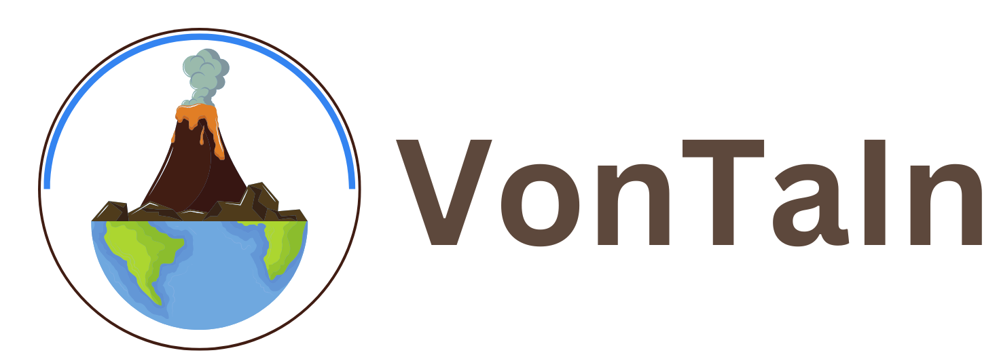

---

### Tentang VonTaIn :
*"VonTaIn  is an application provides 
            comprehensive data and maps of Indonesian volcanoes, including their current activity status. 
            Designed to enhance awareness and support disaster management, VonTaIn offers real-time updates, 
            detailed profiles of each volcano, and visualization tools for better 
            understanding volcanic activity across the archipelago."*

VonTaIn merupakan aplikasi yang menyediakan data dan juga peta gunung berapi di Indonesia, termasuk level aktivitas status yang dimiliki. Aplikasi ini dikembangkan untuk meningkatkan kesadaran masyarakat dan mendukung manajemen kebencanaan, terutama erupsi gunung berapi. VonTaIn menawarkan pembaharuan data dan tanya jawab secara realtime dengan data komprehensif 

---

### Komponen Pembangun :

  &nbsp;
  &nbsp;
  &nbsp;
  &nbsp;
  &nbsp;
  &nbsp; 
  &nbsp;
   &nbsp;
  &nbsp;
  &nbsp;
  &nbsp;

---

### Sumber Data :
- [BNPB](https://www.bnpb.go.id/)
- [Magma ESDM](https://magma.esdm.go.id/)
- Gambar Gunung dari Google

---

### Tangkapan Layar Komponen

  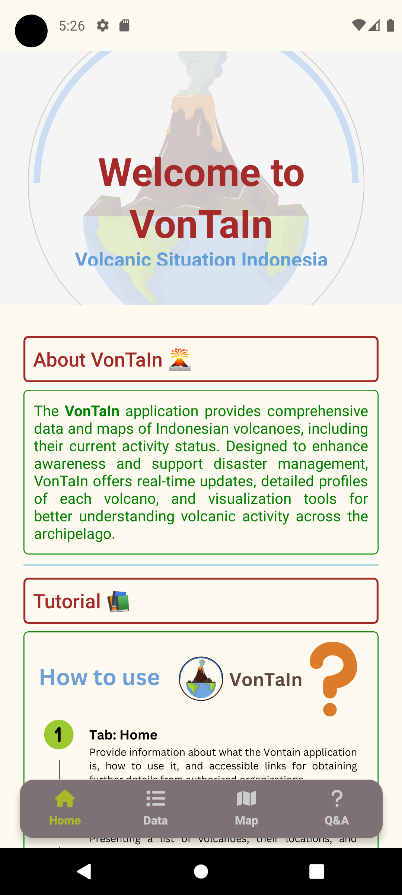
  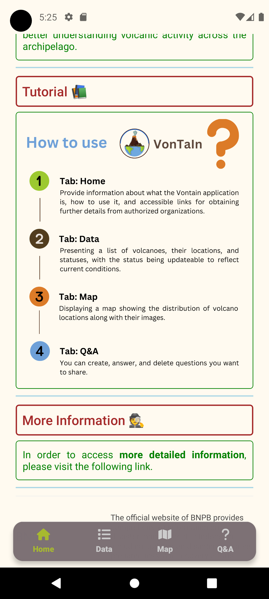

 

  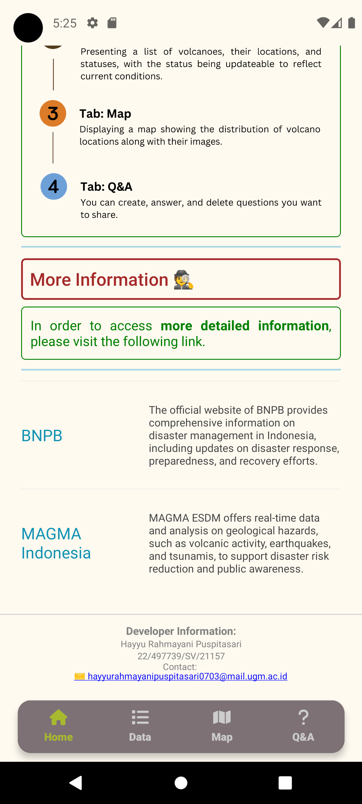
  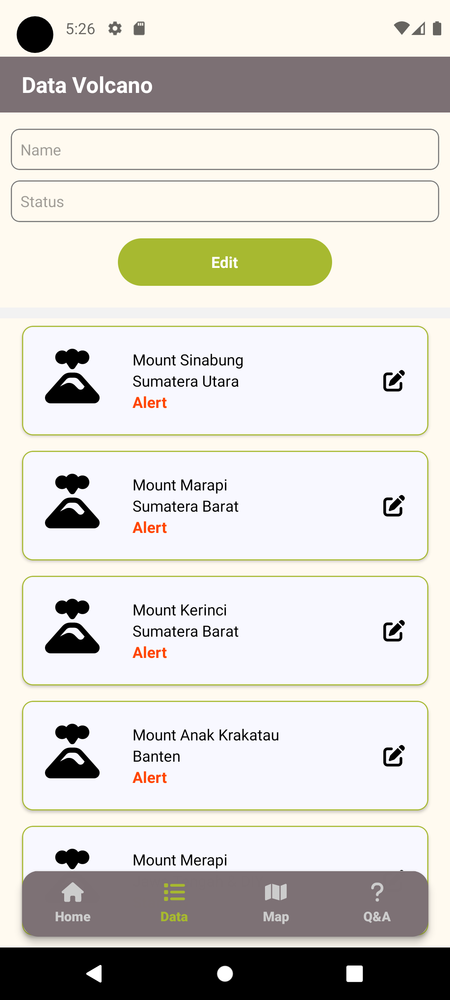

 

  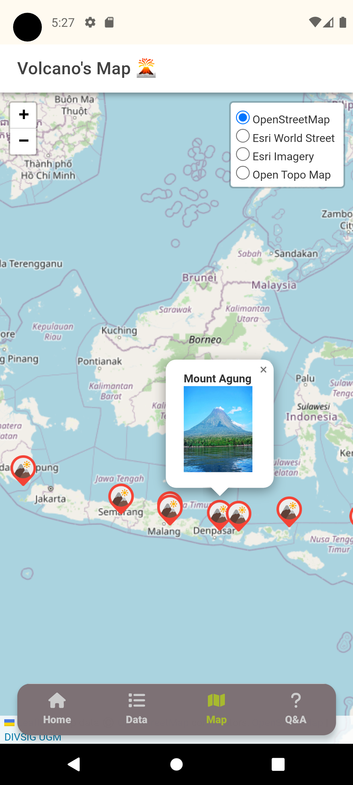
  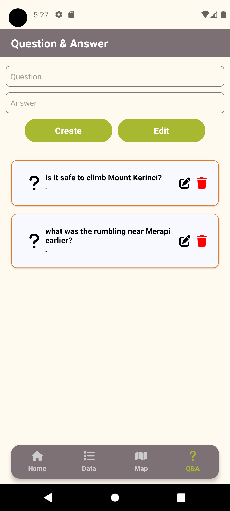

 

  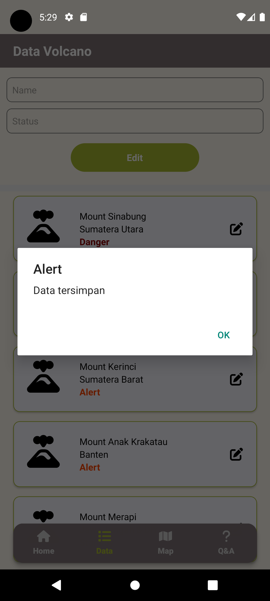
  

 

  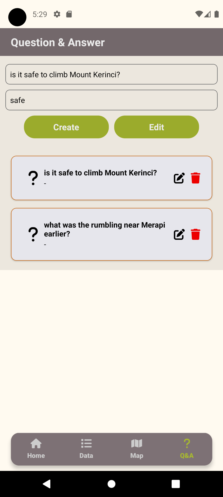
  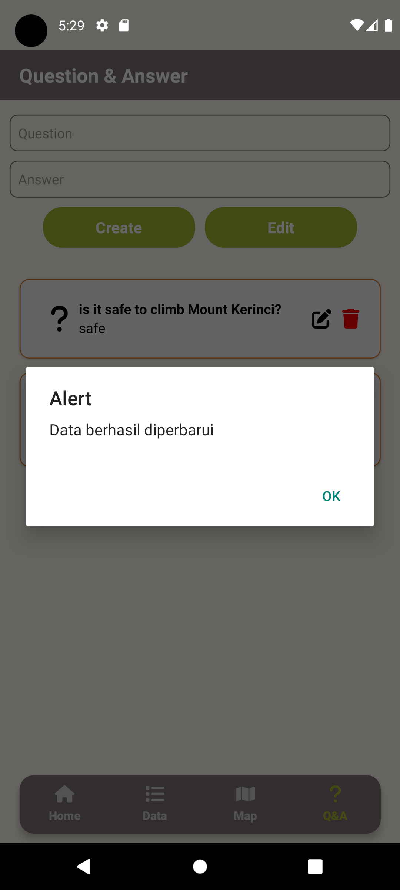

 

  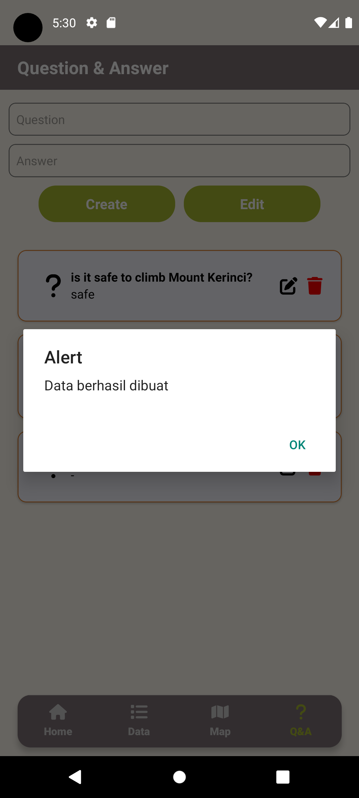
  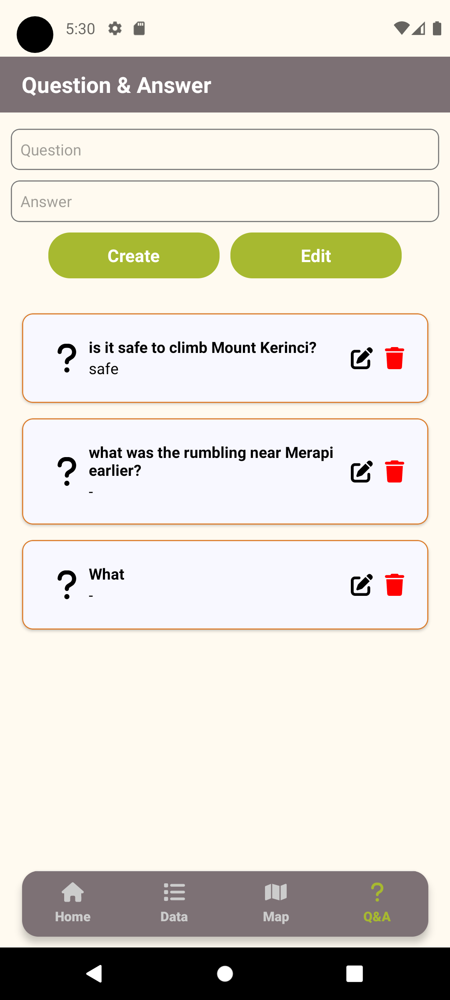

---

### Demonstrasi

